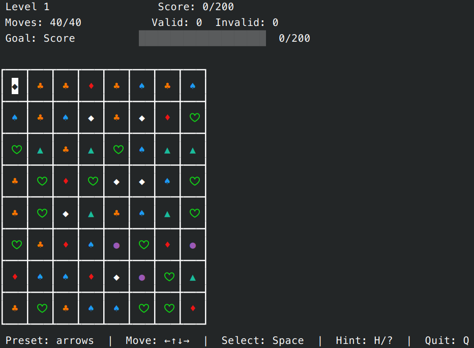

# Match-3 CLI Game

A terminal-based Match-3 puzzle game (Bejeweled / Candy Crush style) written in PHP with no external dependencies.

Swap adjacent gems to form lines of 3+, clear them, and trigger cascading matches. Play through 20 levels with goals, track your score, and compete on the high score board.



## Requirements

- PHP 8.3+

## Install

```bash
composer install
```

## Play

```bash
php bin/play
```

On launch you'll see a welcome screen where you can:

| Setting | Options | Change with |
|---|---|---|
| Game mode | `moves` (default) or `timer` | `←` `→` |
| Key preset | `arrows`, `wasd`, `hjkl` | `←` `→` |
| Start / Leaderboard / Quit | select with `↑` `↓` + `Enter` |

### Welcome screen

| Action | Key |
|---|---|
| Navigate | `↑` `↓` |
| Change value | `←` `→` |
| Select | `Enter` |
| Quit | `Q` / `Escape` |

### In-game controls

| Action | arrows | wasd | hjkl |
|---|---|---|---|
| Move cursor | `↑` `↓` `←` `→` | `W` `A` `S` `D` | `K` `H` `J` `L` |
| Select / swap | `Space` | `Space` / `F` | `Space` / `F` |
| Confirm | `Enter` | `Enter` | `Enter` |
| Hint | `H` / `?` | `H` / `?` | `?` |
| Leaderboard | `B` | `B` | `B` |
| Quit | `Q` / `Escape` | `Q` / `Escape` | `Q` / `Escape` |

You can also click gems with the mouse.

### Custom key bindings

Create a JSON file mapping key names or byte sequences to actions:

```json
{
    "i": "up", "j": "left", "k": "down", "l": "right",
    " ": "select", "q": "quit",
    "up": "up", "space": "select", "escape": "quit"
}
```

Recognised key names: `up`, `down`, `left`, `right`, `space`, `enter`, `escape`, `tab`, or any single character.
Actions: `up`, `down`, `left`, `right`, `select`, `swap`, `confirm`, `quit`, `hint`, `leaderboard`, `cancel`.

## Rules

- Form a line of **3+ matching gems** horizontally or vertically to clear them.
- New gems fall from above, potentially creating **chain reactions** (cascades).
- Each level has a **score goal**. Reach it within the limit (moves or time) to advance.
- **20 levels** with increasing difficulty (fewer gem types, higher targets, fewer moves).
- **Running out of valid moves** or **exceeding the move/time limit** ends the game.
- **High scores** are saved to `data/high_scores.json`, split into separate boards for moves mode and timer mode. Tie-breaker: fewer invalid moves ranks higher.

### Scoring

| Match | Points |
|---|---|
| 3 gems | 30 |
| 4 gems | 60 |
| 5+ gems | 100 |

Each cascade step doubles the points (step 1 = ×1, step 2 = ×2, step 3 = ×4, …).

## Development

```bash
composer install           # Install dependencies (dev included)
php -l src/                # Lint all source files
./vendor/bin/phpunit       # Run tests (61 tests, PHPUnit 13)
```

## Project structure

```
src/
├── Game.php              # Main loop and state machine
├── Grid.php              # Gem grid, match detection, cascade, hints
├── HighScoreBoard.php    # Persistent high scores (JSON, split by mode)
├── Input.php             # Raw terminal input, mouse tracking
├── KeyBindings.php       # Key binding presets and custom maps
├── Level.php             # 20-level table with goals, move and time limits
├── Renderer.php          # ANSI frame rendering, HUD, controls footer
└── WelcomeScreen.php     # Interactive menu for mode and preset selection
data/
└── high_scores.json      # Persisted high scores
tests/
├── FunctionalTest.php    # Integration tests
├── GridTest.php          # Grid logic tests
├── HighScoreBoardTest.php
├── KeyBindingsTest.php
└── LevelTest.php
bin/
├── play                  # Entry point (welcome screen + game loop)
└── leaderboard           # Standalone high score viewer
```

## License

MIT
